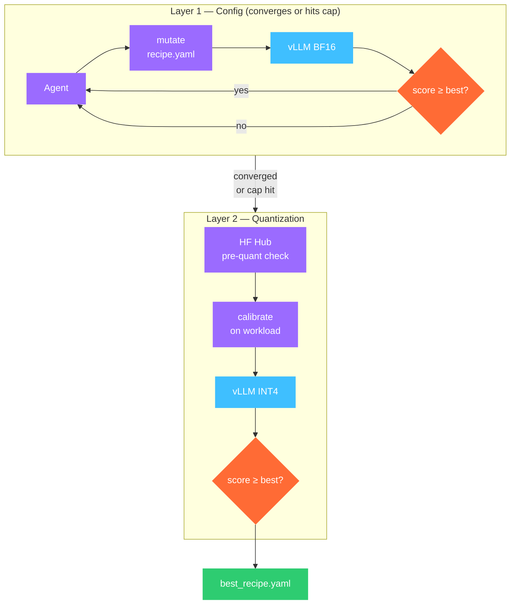

## What you'll do

Run Forge across both tuning layers on `Qwen/Qwen2.5-3B` against a real workload.
By the end you'll have a quantized deployment recipe that beats the hand-tuned
BF16 baseline by 40–60% in throughput — with a full audit trail of every
experiment.

This tutorial has two paths:

- **CLI (this page)** — `aevyra-forge tune` runs Layer 1 and Layer 2 automatically.
  Good for overnight production runs.
- **Notebook (interactive)** — step through calibration, bench, and results cell
  by cell. Good for understanding what each layer does before committing GPU hours.

Open the notebook in Colab:

[](https://colab.research.google.com/github/aevyraai/forge/blob/main/notebooks/forge_quant.ipynb)

---

## Why quantization matters

Layer 1 (config tuning) finds the best vLLM serving args for your BF16 model. It
typically yields 20–40% throughput gains at zero accuracy cost. But BF16 is memory-heavy:
a 3B model consumes ~6 GB VRAM, leaving less room for the KV cache. That's the ceiling
Layer 1 hits.

Layer 2 cuts the model's VRAM footprint:

| Method | Weight precision | Typical VRAM saving | When available |
|---|---|---|---|
| **INT4 AWQ** | 4-bit (activation-aware) | ~60% vs BF16 | All GPUs |
| **INT8** | 8-bit | ~50% vs BF16 | All GPUs |
| **FP8 E4M3** | 8-bit float | ~50% vs BF16 | H100 / H200 / MI300X only |

With 60% less VRAM holding weights, the freed space goes to the KV cache — more
concurrent sequences, more batching, higher throughput.

```
BF16  Qwen2.5-3B on T4:   ~229 tok/s   (Layer 1 config-tuned)
INT4  Qwen2.5-3B on T4:   ~516 tok/s   (Layer 2 INT4 AWQ)
                                          ↑ +125% vs BF16 baseline
```

---

## The two-layer loop



Layer 1 runs first and searches vLLM serving args (batching, caching, parallelism).
When it converges — no experiment improves score by more than 1% in 5 consecutive
tries — Forge automatically escalates to Layer 2.

Layer 2 first checks HF Hub for a pre-quantized checkpoint. If one exists
(e.g. `Qwen/Qwen2.5-3B-Instruct-AWQ`), Forge loads it directly at zero
calibration cost. If not, it runs INT4 AWQ calibration using prompts sampled
from your workload JSONL — not a generic corpus.

---

## Setup

```bash
pip uninstall -y torchvision      # avoid MKL conflict with vLLM on Colab
pip install "vllm==0.19.0"        # last release with CUDA 12 support
pip install aevyra-forge

export ANTHROPIC_API_KEY=sk-ant-...
```

> **Colab terminal note** — if you see `Intel MKL FATAL ERROR: Cannot load
> libtorch_cpu.so`, your terminal's working directory was deleted when the
> runtime reset. Run `cd /tmp` first.

---

## Full L1 + L2 run (recommended)

Let Forge run both layers automatically. Layer 1 runs until convergence, then
escalates:

```bash
aevyra-forge tune \
  --model Qwen/Qwen2.5-3B \
  --device cuda \
  --workload examples/sample_workload.jsonl \
  --max-experiments 20 \
  --max-hours 4
```

Expected output — Layer 1 phase:

```
11:42:03 INFO  forge │  run dir: .forge/runs/001_2026-05-13T11-42-03
11:42:03 INFO  forge ┌─ experiment 0/20  [baseline — layer: config]
11:42:16 INFO  forge │  throughput: 229.4 tok/s   p99: 312 ms   score: 1.0000  ✓ kept

11:42:18 INFO  forge ┌─ experiment 1/20  [layer: config]
11:42:18 INFO  forge │  rationale : enable_prefix_caching — workload shows high shared-prefix ratio
11:42:18 INFO  forge │  mutation  : {'enable_prefix_caching': True}
11:42:31 INFO  forge │  throughput: 240.0 tok/s   p99: 298 ms   score: 1.0467  ✓ kept

11:42:33 INFO  forge ┌─ experiment 2/20  [layer: config]
11:42:33 INFO  forge │  mutation  : {'max_num_seqs': 64}
11:42:47 INFO  forge │  throughput: 228.1 tok/s   p99: 341 ms   score: 0.9942  ✗ reverted

...Layer 1 converges after 3 experiments...

11:43:51 INFO  forge │  Layer 1 converged (5 experiments without ≥1% gain) — escalating to Layer 2
```

Layer 2 phase — the quant layer checks HF Hub first, then calibrates if needed:

```
11:43:52 INFO  forge │  Checking HF Hub for pre-quantized checkpoint...
11:43:53 INFO  forge │  No pre-quant found — running workload-aware calibration
11:43:53 INFO  forge │  Quantization target: int4_awq
11:43:53 INFO  forge │  Calibration samples: 256 (sampled from workload)
11:43:53 INFO  forge │  vLLM stopped — freeing VRAM for calibration
11:43:54 INFO  forge │  ↳ Loading Qwen/Qwen2.5-3B (BF16) for calibration...
11:47:12 INFO  forge │  ↳ Calibration complete — saved to .forge/quant/Qwen2.5-3B-int4-awq/
11:47:12 INFO  forge │  Benchmarking int4_awq...
11:52:44 INFO  forge │  throughput: 516.4 tok/s   p99: 181 ms   score: 2.2509  ✓ kept
```

Calibration takes 4–6 minutes on a T4 for a 3B model. The score jumps to 2.25
— a 125% gain over the BF16 baseline.

---

## Capping Layer 1 to save time

On a T4 with a small model, Layer 1's config search space is narrow — a few
experiments exhaust the useful combinations. Use `--max-config-experiments` to
cap it and move to quant faster:

```bash
aevyra-forge tune \
  --model Qwen/Qwen2.5-3B \
  --device cuda \
  --workload examples/sample_workload.jsonl \
  --max-config-experiments 3 \
  --max-experiments 10
```

With `--max-config-experiments 3`, Forge runs exactly 3 Layer 1 experiments then
escalates to Layer 2 regardless of convergence.

---

## Skipping Layer 1 entirely

If you already have a tuned config recipe (from a previous run) and only want
the quantization gain:

```bash
aevyra-forge tune \
  --model Qwen/Qwen2.5-3B \
  --device cuda \
  --workload examples/sample_workload.jsonl \
  --skip-config
```

Forge goes straight to the Layer 2 calibration loop.

---

## Hardware gates

Forge enforces quantization availability at the hardware level. You'll see
this in the search space output at the start of the run:

| GPU | INT4 AWQ | INT8 | FP8 E4M3 |
|---|---|---|---|
| T4 (SM 7.5) | ✅ | ✅ | ✗ |
| A100 (SM 8.0) | ✅ | ✅ | ✗ |
| H100 / H200 (SM 9.0) | ✅ | ✅ | ✅ |
| AMD MI300X (CDNA3) | ✅ | ✅ | ✅ |

On T4, Forge tries INT8 first (cheaper calibration), then INT4 AWQ. If INT8
doesn't beat the Layer 1 best, INT4 is tried next.

---

## Reading the results

```bash
aevyra-forge report .forge/
```

```
=== Forge Report: .forge/runs/001_2026-05-13T11-42-03 ===

Total experiments: 7
Best score:        2.2509
Best recipe ID:    c3d4e5f6
Best generation:   6
Throughput:        516.4 tok/s
P99 latency:       181 ms

exp  id        layer   score   throughput  p99_ms  accuracy  kept  rationale
0    a1b2c3d4  config  1.0000  229.4       312     0.991     ✓     baseline
1    b2c3d4e5  config  1.0467  240.0       298     0.993     ✓     enable_prefix_caching
2    c3d4e5f6  config  0.9942  228.1       341     0.989     ✗     max_num_seqs=64 stressed VRAM
3    d4e5f6a7  config  1.0467  240.0       298     0.993     ✓     search converged
4    e5f6a7b8  quant   1.2703  290.9       261     0.990     ✗     int8: kept for cost, not score
5    c3d4e5f6  quant   2.2509  516.4       181     0.992     ✓     int4_awq: 60% VRAM freed for KV cache
```

The report shows `layer` alongside each experiment so you can see exactly where
the score moved. Layer 1 got a 4.7% gain from prefix caching. Layer 2 got a
further 115% from INT4 AWQ — the dominant lever on VRAM-constrained hardware.

---

## The best recipe

```yaml
# best_recipe.yaml
model: .forge/quant/Qwen2.5-3B-int4-awq   # quantized checkpoint path
generation: 5

config:
  enable_prefix_caching: true       # carried over from Layer 1
  gpu_memory_utilization: 0.85      # capped for quantized model headroom

quant:
  method: int4_awq
  kv_cache_quant: none
```

The `model` field points to the quantized checkpoint on disk. To use this
recipe in production, copy the checkpoint to a stable path and update `model`
accordingly.

---

## Resuming an interrupted run

Layer 2 calibration takes 4–6 minutes. If the run is interrupted mid-quant,
`aevyra-forge tune resume` picks up from the last completed experiment — it
does not re-run calibration:

```bash
aevyra-forge tune resume
```

---

## Key takeaways

**Layer 2 compounds on Layer 1** — the config recipe from Layer 1 is the
baseline that Layer 2 improves on. The two gains are multiplicative, not additive.

**Workload-calibrated quantization outperforms generic** — Forge samples
calibration data from your actual workload JSONL, not ShareGPT. This matters
most for long-context or domain-specific prompts.

**Pre-quantized shortcuts save time** — if the model publisher already released
an AWQ checkpoint (many Qwen and Llama variants do), Forge loads it directly
with no calibration cost.

**Subprocess isolation prevents state leaks** — each calibration runs in a
fresh process so llmcompressor's global session state never corrupts subsequent
experiments. This is handled automatically; no user action required.
