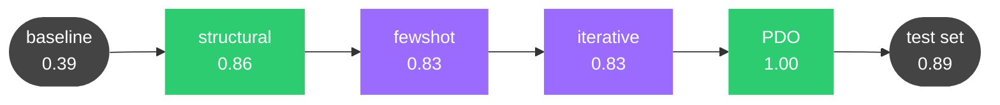
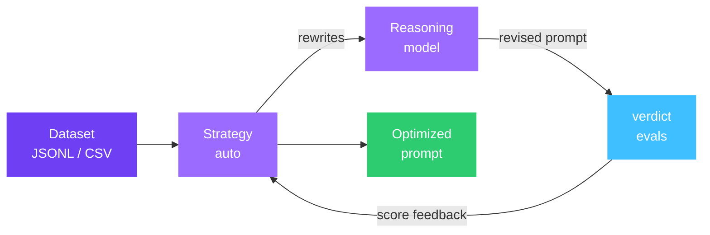
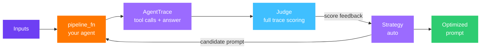

aevyra-reflex diagnoses why your prompt is falling short and rewrites it —
iterating until it converges. Every rewrite is accompanied by a reasoned
explanation of what changed and why. Runs can be interrupted and resumed at
any point without losing work, and every token spent is tracked across
sessions.

```bash
pip install aevyra-reflex
```

Works with any model — local Ollama or vLLM, OpenAI, Anthropic, Gemini, or
any OpenAI-compatible endpoint. All evaluation runs through
[aevyra-verdict](https://github.com/aevyraai/verdict).

## Two optimization modes

Reflex works in two modes depending on whether your task can be evaluated
from a static dataset or requires running a live agent.

**Standard mode** — you have a dataset of (input, ideal output) pairs. Reflex
scores each prompt candidate against that dataset and rewrites the prompt until
scores converge. Use this for summarization, classification, extraction, translation,
and any task where the output is a string you can compare to a reference.

```bash
aevyra-reflex optimize dataset.jsonl prompt.md -m openrouter/meta-llama/llama-3.1-8b-instruct -o best_prompt.md
```

**Pipeline mode** — your task involves an agent that calls tools, retrieves
context, or takes actions. A static dataset cannot tell whether the agent
called the right tools or used their results correctly. In pipeline mode, you
provide a `pipeline_fn` that runs your full agent; reflex re-runs it on every
candidate prompt and passes the complete execution trace — tool calls, tool
results, and final answer — to the judge. The optimizer gets system-level
signal rather than output-level signal.

```bash
aevyra-reflex optimize \
  --pipeline-file agent/pipeline.py \
  --inputs-file   agent/questions.json \
  prompt.md \
  --judge openrouter/anthropic/claude-sonnet-4-5 \
  --judge-criteria agent/judge.md \
  -o best_prompt.md
```

See the [pipeline mode tutorial](/reflex/tutorial-dev-assistant) for a complete
walkthrough.

## Dashboard

Every run is immediately explorable in the built-in dashboard:

```bash
aevyra-reflex dashboard
```

No separate server, no build step — opens `http://localhost:8128` with score
trajectory charts, prompt diffs, reasoning analysis, and token usage. Branch
from any iteration to continue with a different strategy.

<CardGroup cols={2}>
  <Card title="Quick start" icon="bolt" href="/reflex/quickstart">
    Optimize your first prompt in under 5 minutes
  </Card>
  <Card title="Tutorial: standard mode" icon="book-open" href="/reflex/tutorial-security-incidents">
    Full walkthrough: 0.38 → 0.89 on a real format-compliance task
  </Card>
  <Card title="Tutorial: pipeline mode" icon="robot" href="/reflex/tutorial-dev-assistant">
    Optimize a tool-calling agent with system-level signal
  </Card>
  <Card title="Open the dashboard" icon="chart-line" href="/reflex/dashboard">
    Score charts, prompt diffs, reasoning traces, and branch runs
  </Card>
</CardGroup>

## Why reflex

**No config files.** No YAML. No framework to learn. Point it at a dataset and
a prompt file and it runs.

**Lightweight.** No heavy framework dependencies. Just Python, standard
library, and `numpy` for PDO math. Installs in seconds and has no opinion
about the rest of your stack.

**Fully local.** Ollama and vLLM are supported — run everything on your own
hardware so nothing leaves your machine:

```bash
aevyra-reflex optimize dataset.jsonl prompt.md \
  -m local/llama3.1:8b\
  --reasoning-model ollama/qwen3:8b
```

**Agentic, not scripted.** Each iteration the reasoning model explains *why* it
made a change — you learn from the run, not just get an output. The causal
rewrite log tracks what helped, what had no effect, and what hurt, so the model
avoids repeating dead ends.

**Crash-safe resumption.** Every iteration is checkpointed to disk as it
completes. Kill the process, restart the machine, lose your connection —
`--resume` picks up exactly where it left off. Val history, best-prompt
selection, and token totals are all restored correctly across as many
interruptions as you need.

**Full token accounting.** Eval tokens and reasoning tokens are tracked per
iteration and accumulated across sessions, including resumed runs. The final
results show the true total cost of the optimization, not just the last session.

**Overfitting protection.** An optional validation split monitors generalization
throughout training. The best prompt is selected against the val set — so the
final test eval reflects real-world performance rather than a prompt tuned to
the specific examples it was optimized on.

## What it does

Given a dataset and a starting prompt, aevyra-reflex:

1. Runs a baseline eval on a held-out test set to measure the starting score
2. Optimizes the prompt on the training set, iterating until the score meets the target
3. Re-evaluates on the held-out test set so reported improvement is honest
4. Returns the optimized prompt with a full before/after comparison, token costs, and significance test

## When to use it

**Standard mode**
- You ran verdict and model A beats model B — you want to close the gap through prompt engineering, not by switching models
- A model scores poorly on your eval — you want a better prompt, not a bigger model
- You're iterating on a system prompt and want to automate the feedback loop
- You want to understand *why* a prompt works (the analysis teaches prompt engineering)
- You're migrating a prompt from one model family to another (e.g. Claude → Llama)

**Pipeline mode**
- Your agent calls tools and you need to verify it actually uses them, not just produces plausible answers from memory
- The correctness of the final output depends on intermediate steps (retrieval, tool calls, multi-hop reasoning) that a static dataset cannot observe
- You want the optimizer to have system-level signal — what tools were called, what they returned, where the answer went wrong — rather than output-level signal

## Optimization strategies

The **auto** strategy (default) picks the right technique for each phase.
You can also run any strategy directly.

<CardGroup cols={2}>
  <Card title="Auto" icon="wand-magic-sparkles" href="/reflex/strategies">
    Multi-phase pipeline — structural → iterative → fewshot, chosen adaptively
  </Card>
  <Card title="Iterative" icon="arrows-spin" href="/reflex/strategies#iterative">
    Diagnose failures, revise wording, repeat. Label-free aware.
  </Card>
  <Card title="Structural" icon="table-columns" href="/reflex/strategies#structural">
    Reorganize formatting, sections, and hierarchy
  </Card>
  <Card title="PDO" icon="trophy" href="/reflex/strategies#pdo">
    Tournament-style search with dueling bandits and adaptive ranking
  </Card>
</CardGroup>

A typical **auto** run (from the [security incidents tutorial](/reflex/tutorial-security-incidents)):



Each phase hands its best prompt to the next. Structural made the biggest jump (formatting was the main gap); PDO polished it to convergence.

## How it fits together

**Standard mode** — the prompt is scored against a static dataset:



**Pipeline mode** — the full agent is re-run on every candidate prompt:



<CardGroup cols={2}>
  <Card title="CLI reference" icon="terminal" href="/reflex/cli">
    All commands and flags
  </Card>
  <Card title="Strategies" icon="chess" href="/reflex/strategies">
    How each optimization axis works
  </Card>
  <Card title="Configuration" icon="gear" href="/reflex/configuration">
    Tuning iterations, thresholds, and parallelism
  </Card>
  <Card title="Providers" icon="server" href="/reflex/providers">
    OpenAI, Anthropic, Gemini, Ollama, and more
  </Card>
</CardGroup>
